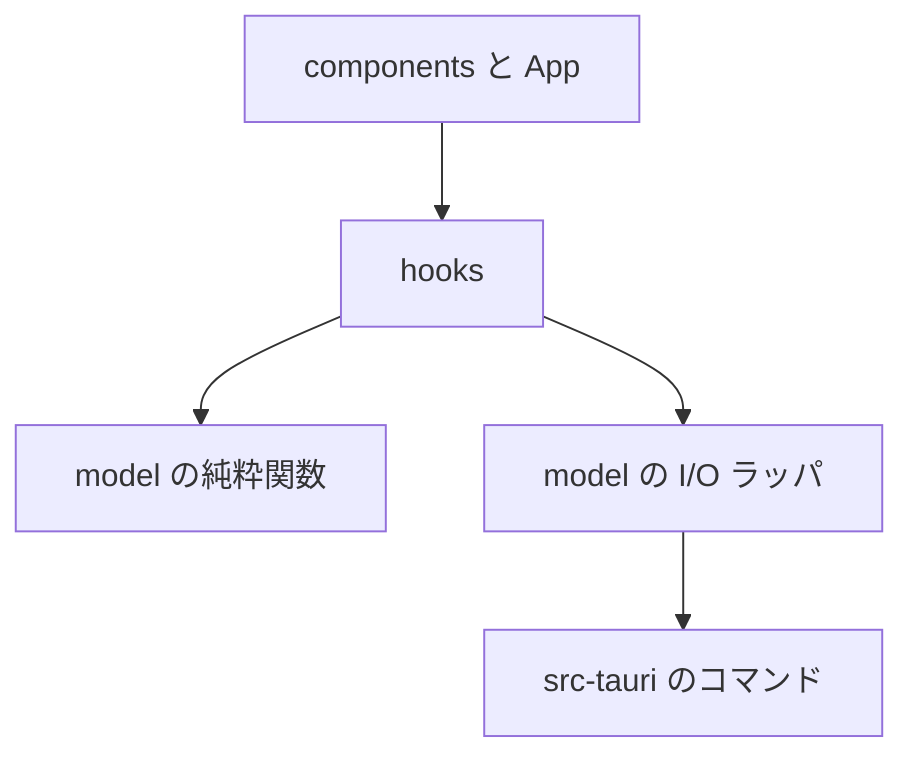
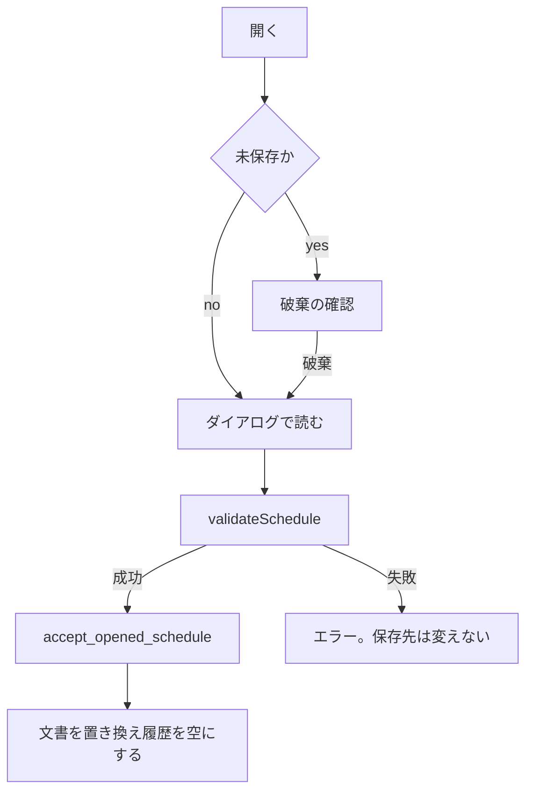
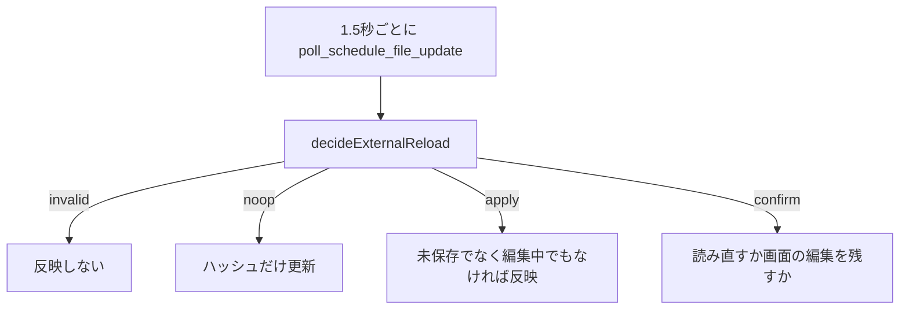

# 内部仕様

開発者が構成と処理の流れを追うための文書である。正本はソースコードで、この文書と食い違ったときはコードに合わせる。画面の挙動は [外部仕様](external-spec.md)、ファイルの形は [データ仕様](data-format.md) にある。

## 全体構成

画面は React で、時間軸は react-konva で描く。ファイルの読み書きは Tauri の Rust 側が行う。Rust は JSON の意味を解釈しない。検証、行の計算、取り消し履歴、書き出すファイルの生成は、フロントの `src/model/` にある。

| 場所 | 責務 |
| --- | --- |
| `src/main.tsx` | React のマウント |
| `src/App.tsx` | 画面の組み立て、ダイアログの接続、キーボードショートカットと右クリックメニュー |
| `src/components/` | ツールバー、サイドバー、タイムライン、各ダイアログ |
| `src/hooks/` | 文書（スケジュールの内容）、ファイル、ズーム、今日、メンバー、カレンダーの状態 |
| `src/model/` | 型、検証、行、座標、履歴、書き出し。I/O を持つのは一部だけ |
| `src/sample/` | 起動時のサンプル |
| `src-tauri/src/lib.rs` | ダイアログ、原子的な書き込み、アプリデータ、内容ハッシュ |
| `scripts/` | 検証器の生成、サンプル検査、バージョン同期 |
| `docs/*.schema.json` | JSON Schema の正本 |
| `.cursor/skills/` | LLM 用のスキル。`write-schedule`、`write-members`、`write-calendar` は他のリポジトリへコピーして使う |

依存は上の図の向きだけである。`model` はコンポーネントを参照しない。

## モジュール一覧

### コンポーネント

| ファイル | 役割 |
| --- | --- |
| `AppMenu.tsx` | ☰ メニュー |
| `ContextMenu.tsx` | タスクとマイルストンの右クリックメニュー。`#root` に出す |
| `Toolbar.tsx` | 見出し、検索、絞り込み、系統、追加、削除、ズーム |
| `Sidebar.tsx` | 左の行、折りたたみ、名前の横ずらし |
| `Timeline.tsx` | Konva のヘッダー、バー、前後の線、イナズマ線、ドラッグでのスクロール |
| `MilestoneBand.tsx` | マイルストンのひし形 |
| `*Dialog.tsx` | [外部仕様](external-spec.md#ダイアログ) の各ダイアログ |
| `ModalDialog.tsx` | 共通の枠。Escape、フォーカスの保持、背面の操作禁止 |
| `TaskNoteButton.tsx` | ノートの有無で色を分けるボタン |

### フック

どれも React の状態か副作用を持つ。

| フック | 持つもの |
| --- | --- |
| `useSchedule` | 文書、取り消し、絞り込み、選択、折りたたみ、系統、編集対象 |
| `useScheduleFile` | パス、未保存の基準、開く・保存、外部更新、控え、閉じる確認 |
| `useTimelineView` | 1日あたりの幅、スクロール、ホイール |
| `useToday` | 今日の日付。日付が変わると更新する |
| `useMemberCatalog` | カタログの読み込みと選択 |
| `useAppCalendar` | カレンダーの読み込み |

### モデル

純粋関数が大半である。副作用があるのは、`scheduleFile.ts`、`memberAppData.ts`、`calendarAppData.ts`、`exportHtml.ts` の保存、`uiScale.ts` と `colorScheme.ts` と `sidebarWidth.ts` の localStorage だけである。

| 関心 | ファイル |
| --- | --- |
| 型 | `types.ts`、`memberTypes.ts`、`calendarTypes.ts` |
| 検証 | `validateSchedule.ts`、`validateMembers.ts`、`validateCalendar.ts`、`*Semantics.ts`、`scheduleMigrate.ts`、`validationMessages.ts`、`generated/` |
| 行と前後関係 | `rows.ts`、`dependencies.ts`、`summary.ts`、`tasks.ts` |
| 時間軸 | `timeline.ts`、`timelineVisibleDays.ts`、`dates.ts`、`nonWorkingDay.ts`、`milestones.ts` |
| 担当とノート | `assigneeDisplay.ts`、`taskNote.ts` |
| 履歴と保存形式 | `history.ts`、`serialize.ts` |
| 画面と開いているファイルの差分 | `scheduleDiff.ts` |
| ファイルの入出力と、外部更新・控えの判定 | `scheduleExternalReload.ts`、`scheduleRecovery.ts`、`scheduleFile.ts` |
| アプリデータ | `memberAppData.ts`、`calendarAppData.ts` |
| 書き出し | `exportHtml.ts`、`exportView.ts`、`exportFilename.ts` |
| 見た目の寸法と配色 | `layoutSizes.ts`、`uiScale.ts`、`sidebarWidth.ts`、`colorScheme.ts`、`palette.ts` |
| キーボードショートカット | `shortcuts.ts` |

## 状態

状態は3種類に分かれる。

| 種類 | 中身 | 置く場所 | 残るか |
| --- | --- | --- | --- |
| 文書（`ScheduleDocument`） | タイトル、カテゴリ、マイルストン | `useSchedule` | ファイルと控えだけ。取り消しはメモリ |
| 表示 | 絞り込み、選択、折りたたみ、系統、ズーム、スクロール | `useSchedule` と `useTimelineView` | 残さない。ファイルを開くと初期化する |
| ファイル | パス、未保存判定の基準にする JSON、ディスクのハッシュ | `useScheduleFile` と Rust の `ScheduleFileState` | 前回のパスは `last-schedule.json`。未保存の控えはアプリデータ |

取り消しのスナップショットに入るのは `categories` と `milestones` だけである。タイトルは履歴に入らない。`history.ts` は、内容が同じ変更を積まず、最大 100 件で古いものから捨てる。バーの移動と端のドラッグは、離したときに1回だけ `commitDocument` する。

表示の状態のうち、表示サイズ、配色、左一覧の基準幅だけは localStorage に残る。キーの一覧は [データ仕様](data-format.md#アプリデータ) にある。画面に反映する解決済みの配色（ライトかダーク）は React の状態で持ち、システム追従のときは `prefers-color-scheme` の変化を監視する。左一覧の幅は、希望の基準幅と、チャートが 200px を下回らないよう縮めた表示幅を分ける。ウィンドウを狭めたときは表示だけ縮め、希望幅は残す。

## 主な処理の流れ

### 開く

ブラウザ版はダイアログの代わりにファイル選択を使い、`accept_opened_schedule` は呼ばない。

### 保存

`save_schedule_file` は、上書きのとき開いているパスと要求パスが一致することを見る。パスが無いときは、フロントが別名保存として保存ダイアログを開く。`skip_disk_hash_check` が無いときは、記憶している SHA-256 とディスクを比べ、違えば `DISK_HASH_MISMATCH` を返す。フロントはこのとき SYNC-02 の確認を出す。書き込みは一時ファイルへ書いてから置き換える。

### 外部更新

判断は `scheduleExternalReload.ts` の純粋関数である。自分の保存のあとは `acknowledge_schedule_file_contents` でハッシュを更新し、直後の監視を外部更新とみなさない。

### 差分

「差分を表示」は、画面の保存形式と、`read_open_schedule_file` で読んだ開いているファイルを `formatScheduleDiff` に渡す。パスが無い、またはブラウザ版のときはファイルを読まず、「比べるファイルがありません」と出す。検証に失敗したときは差分ダイアログを出さない。読んだ内容は保存しない。`content_hash` は変えない。

### 前回のファイルと控え

開く成功と保存の成功で、`record_open` が `last-schedule.json` にパスを書く。未保存でパスがあるとき、変更から約1秒後と閉じる直前に `write_schedule_recovery` を呼ぶ。パスが無い状態で閉じるときは `clear_last_schedule_path` で覚えたパスを消す。

起動時は `read_last_schedule_file` と `read_schedule_recovery` を読む。`read_last_schedule_file` は呼び出し元からパスを受け取らず、`last-schedule.json` のパスだけを読む。そのファイルが無いときは、控えの `path` に戻る。`decideRecoveryStartup` が、保存済みで開く、未保存の復元、競合、ファイル無し、不正を返す。覚えたパスと控えのパスが違うときは、覚えたパスを優先して控えは消す。ファイルが無く未保存があるときは、先にその内容を画面へ載せてから警告する。この起動でファイル無しを知らせたあとは、そのパスが再び読めるまで監視のファイルダイアログを出さない。`read_schedule_file_at_path` は、控えに書いてあるパスと一致するファイルだけを読む。

### 書き出し

`exportView.ts` が見える行からマイルストンと期間を決め、`exportHtml.ts` が SVG を組み立てる。デスクトップ版は `save_html_file`、ブラウザ版はダウンロードである。

## 検証の流れ

配布ビルドの CSP には `unsafe-eval` が無い。Ajv でスキーマを実行時にコンパイルできないので、`scripts/compile-validators.mjs` がスキーマから、単体で動く検証コード（Ajv の standalone 出力）を `src/model/generated/` に作る。`dev`、`build`、`test` は先にこれを実行する。

スケジュールは次の順で見る。

1. schemaVersion 1 なら、終了日を1日戻して schemaVersion 2 にする
2. schemaVersion 2 は拒否する
3. JSON Schema
4. 意味規則（ID の重複、先行の実在、循環など、スキーマでは表せない規則）

メンバーとカレンダーも、JSON Schema のあとに意味規則を見る。`validationMessages.ts` は、エラーの場所を示す JSON Pointer をカテゴリやタスクの名前に置き換えて、エラー文言を作る。

`write-schedule`、`write-calendar`、`write-members` に同梱する検証スクリプトは、`scripts/build-validate-skill.mjs` が同じ検証を1ファイルにまとめて作る。このスクリプトは、スキーマもスキルのフォルダへコピーする。CI は、その結果がコミット済みと一致するかを見る。手順は [開発ガイド](development.md#スキーマを変えるとき) にある。

## Tauri コマンド

実装は `src-tauri/src/lib.rs`、許可は `src-tauri/capabilities/default.json` と `src-tauri/permissions/` にある。

| コマンド | 引数と戻り値 | 失敗と上限 | permission | TS |
| --- | --- | --- | --- | --- |
| `open_schedule_file` | ダイアログ。任意の初期ディレクトリ。パスと本文、または取り消し | 10MB、UTF-8 | `open-schedule-file.toml` | `scheduleFile.ts` |
| `accept_opened_schedule` | パスと本文。状態を記録 | 10MB | 同上 | 同上 |
| `check_schedule_file_changed` | ディスクのハッシュが記憶と違うか | ファイルを開いていない | `check-schedule-file-changed.toml` | 同上 |
| `poll_schedule_file_update` | 変化したときだけ本文 | 同上 | `poll-schedule-file-update.toml` | 同上 |
| `read_open_schedule_file` | 引数なし。開いているパスの本文 | ファイルを開いていない、10MB、UTF-8 以外 | `read-open-schedule-file.toml` | 同上 |
| `acknowledge_schedule_file_contents` | 本文。ハッシュを更新 | ファイルを開いていない | `poll-schedule-file-update.toml` | 同上 |
| `save_schedule_file` | 本文、別名か、提案名、期待パス、ハッシュ確認を飛ばすか。保存したパス | 10MB、`DISK_HASH_MISMATCH`、パス不一致、拡張子 | `save-schedule-file.toml` | 同上 |
| `save_html_file` | 本文、提案名、拡張子 | 10MB | `save-html-file.toml` | `exportHtml.ts` |
| `get_members_settings` | カタログ一覧と選択中 ID | — | `members-app-data.toml` | `memberAppData.ts` |
| `read_member_catalog` | カタログ ID。本文 | 2MB | 同上 | 同上 |
| `import_member_catalog` | ID、本文、上書きするか | 2MB、重複 | 同上 | 同上 |
| `delete_member_catalog` | ID | — | 同上 | 同上 |
| `set_selected_member_catalog` | ID または無し | — | 同上 | 同上 |
| `get_calendar_state` | 表示名 | — | `calendar-app-data.toml` | `calendarAppData.ts` |
| `read_app_calendar` | 本文 | 2MB | 同上 | 同上 |
| `import_app_calendar` | 表示名と本文 | 2MB | 同上 | 同上 |
| `delete_app_calendar` | なし | — | 同上 | 同上 |
| `read_schedule_recovery` | 控えの本文 | 10MB | `schedule-recovery.toml` | `scheduleFile.ts` |
| `write_schedule_recovery` | 本文 | 10MB | 同上 | 同上 |
| `delete_schedule_recovery` | なし | — | 同上 | 同上 |
| `read_schedule_file_at_path` | パス。控えのパスと一致するときだけ本文 | `SCHEDULE_FILE_NOT_FOUND` | 同上 | 同上 |
| `read_last_schedule_file` | 引数なし。覚えたパスと本文。無ければ null | 記録の形式。欠落は戻り値の error に `SCHEDULE_FILE_NOT_FOUND` | 同上 | 同上 |
| `clear_last_schedule_path` | なし | — | 同上 | 同上 |

ダイアログで選んだだけでは `ScheduleFileState` は更新されない。検証に通したあと `accept_opened_schedule` を呼ぶ。

## 永続化

`ScheduleFileState` はプロセス内の Mutex で、開いているパスと本文の SHA-256 を持つ。フロントの未保存判定（基準 JSON との文字列比較）とは別である。前回開いたパスは `last-schedule.json` に残る。

`write_utf8_atomic` は、同じディレクトリの一時ファイルへ書き、flush と sync のあと `persist` で置き換える。

アプリデータと localStorage の中身は [データ仕様](data-format.md#アプリデータ) のとおりである。上限は `MAX_SCHEDULE_BYTES`、`MAX_HTML_BYTES` が 10MB、`MAX_MEMBERS_BYTES` と `MAX_CALENDAR_BYTES` が 2MB である。

## セキュリティ

CSP は `default-src 'self'` で、インラインのスタイルと、Tauri の IPC 接続だけを追加で許す。Windows の IPC のため `connect-src` に `ipc:` と `http://ipc.localhost`、`https://ipc.localhost` がある。スクリプトの eval は許さない。

capability はメインウィンドウに、`core:default`、ウィンドウの close と destroy、上のコマンドだけを与える。close と destroy は、未保存の確認のあとフロントからウィンドウを閉じるために必要である。

上書きは、開いているパスとフロントが渡したパスが一致するときだけ行う。任意のパスを読めるコマンドは無く、`read_last_schedule_file` は覚えたパス（無ければ控えのパス）だけを読む。`read_schedule_file_at_path` は控えに書いたパスだけを読む。`read_open_schedule_file` は呼び出し元からパスを受け取らず、`ScheduleFileState` が覚えている開いているパスだけを読む。保存するファイル名は、区切り文字、制御文字、Windows の予約名を除く。カタログ ID も、パスに使えない文字を拒否する。

## 描画

`Timeline.tsx` は日付ヘッダー、本体、前後の線、親バー、タスクバー、イナズマ線を Konva で描く。マイルストンは `MilestoneBand.tsx` である。左の名前は DOM の `Sidebar.tsx` で、縦位置だけをチャートと揃える。一覧の幅は `--sidebar-w` に、希望の基準幅をチャート余白で縮めた値を入れ、表示倍率を掛けて描く。右端の境界をドラッグすると希望の基準幅が変わる。表示が動かないドラッグでは希望幅を変えない。

座標の基準は `pxPerDay` である。日付から x を計算し、ズームのたびに描き直す。CSS の拡大は使わない。表示期間は、全タスクと全マイルストンのうち、最も早い日付の6日前から最も遅い日付の7日後までである（`computeTimelineRange`）。書き出しは、見えている行から同じ余白で決め直す。

`uiScale` は文字と行の倍率で、`layoutSizes.ts` のヘッダー 40px、行 32px、バー 20px、マイルストン段 26px に掛ける。自動は幅 1100px、高さ 780px を基準にし、1 未満にはしない。固定は 0.5 から 2 である。

マイルストンの段は、日付順に見て、前のラベルと重ならない最初の段に置く。どの段にも入らなければ段を増やす。横位置の原点は固定なので、スクロールしても段は変わらない。

## 主なアルゴリズム

| 処理 | 場所 | 内容 |
| --- | --- | --- |
| 行の絞り込み | `rows.ts` の `taskMatchesFilter` | 系統、担当、ステータス、期限、破綻、マイルストン、名前、ノートをすべて満たすタスクだけを残す。0件のグループとカテゴリは行にしない |
| 系統 | `dependencies.ts` の `lineageTaskIds` | 起点から先行と後続を辿る。起点を通らない枝は入れない |
| 循環 | `scheduleSemantics.ts` の `validateDependencyCycles` | 先行を深さ優先でたどり、たどっている途中のタスクへ戻ったら循環とみなす。編集の保存時にも見る |
| 破綻 | `dependencies.ts` の `isBrokenLink` | 後続の開始が先行の終了より前。同じ日は破綻でない |
| 親バー | `summary.ts` の `summarizeSpans` | 開始順に並べ、次が前の終了の翌日以前ならつなぐ。1日空くと分ける |
| イナズマ線 | `timeline.ts` の `lightningDate` | 期限超過なら終了日。着手済みで開始が今日より後なら開始日。それ以外は今日 |
| 期限超過 | `timeline.ts` の `isOverdue` | 完了以外で終了日が今日より前 |
| マイルストン超過 | `milestones.ts` の `milestonesExceededBy` | 終了日が対応マイルストンの日付より後 |
| 外部更新の判断 | `scheduleExternalReload.ts` | 不正、同じ内容、確認、即時反映 |
| 起動時の前回ファイル | `scheduleRecovery.ts` | 保存済みなら開く。一致なら未保存を復元、違いなら競合。ファイル無しと不正は別の結果 |
| 書き出しの期間 | `exportView.ts` | 見えている行と、選んだマイルストン。画面全体の期間は使わない |

## ビルドとツール

Vite は、ブラウザ版の `npm run dev` ではポート 5173、`tauri dev` ではポート 1420 を使い、`src-tauri` の変更では再起動しない。Vitest は `src/**/*.test.ts` を Node 上で実行する。TypeScript は `strict` で、`npm run build` の `tsc` が型を見る。ESLint は `dist`、`src-tauri`、`mockup`、`.cursor` を見ない。

Rust は 1.98.1 で、CI は `cargo clippy -- -D warnings` と `cargo test --locked` を実行する。バージョン番号は `package.json`、`package-lock.json`、`tauri.conf.json`、`Cargo.toml`、`Cargo.lock` を `scripts/check-version-sync.mjs` で揃える。`postinstall` は、その OS 向けの Tauri CLI があることを確認する。

npm スクリプトと CI の分岐は [開発ガイド](development.md#npm-スクリプト) にある。

## 注意点

- `rows.ts` の `ROW_HEIGHT` と `layoutSizes.ts` の `LAYOUT_ROW_HEIGHT` は、どちらも 32 で二重に定義されている。画面が使うのは、`App.tsx` が `scaledLayoutSizes` から渡す高さである
- 書き出しは、表示中の Konva を撮るのではなく、モデルから SVG を組み立て直す。見た目は近づけるが、別の実装である
- `mockup/schedule-viewer-mockup.html` は初期の検証用で、アプリからは参照しない。ESLint の対象外である
- schemaVersion 1 の移行関数はあるが、移行結果の 2 は必ず拒否する。実際に開けるのは 3 だけである
- 取り消しはドラッグの途中では積まない。離したときの確定が1ステップである
